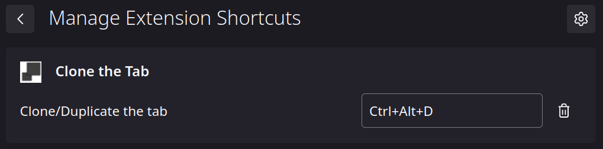

## What it does

['Clone the Tab'](https://addons.mozilla.org/de/firefox/addon/clone-the-tab/ "Clone the Tab") is a Firefox Add-on that duplicates the current tab and opens it.

## Why does this addon exist?

Mozilla did not implement a key-combination to clone/duplicate a tab in Firefox.

## How does it work?

Just click the icon of this Add-on or press "Ctrl+Alt+D" / "Cmd+Alt+D".

## How to change the shortcut?

Mozilla documented how to change the shortcuts of extensions [here](https://support.mozilla.org/en-US/kb/manage-extension-shortcuts-firefox)

